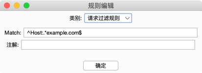

# Burp插件：发现网站中的链接

## 主动发现
1. 选择想要提取的目标请求/响应，右键【扩展-嗅探JS-提取到粘贴板】
   
   
2. 此时，弹出窗口，默认已有正则，也可以自定义提取正则，点击【确定】
   
   
3. 在文本里直接粘贴即可，提取的链接将按行显示，调整后可导入burp intruder里。

## 被动发现
1. 打开配置面板，默认规则如下。
   
   
> 规则说明
> 
   
> 规则分为：请求过滤规则，响应匹配规则
> 
> 请求过滤规则：只有匹配全部请求过滤规则的才进行处理。
> #### 默认只匹配js和html后缀，可以添加指定host的匹配规则，减少消耗。
> 
> 响应匹配规则：从响应中提取内容，匹配任意一个响应匹配规则都会被提取。
> 
2. 点击【开启嗅探】，即会被动进行发现。之后切换到结果页面，可查看详细结果。
   
   
3. 此外，还内置了原始请求页，方便快速查看分析。
   

## 其他功能
右键菜单还内置了一个保存文件的功能，右键【扩展-嗅探JS-保存到文件】，可以直接将二进制内容保存为文件。
>常见的用法是，保存为png、pdf、word等文件。总之，就是下载。

